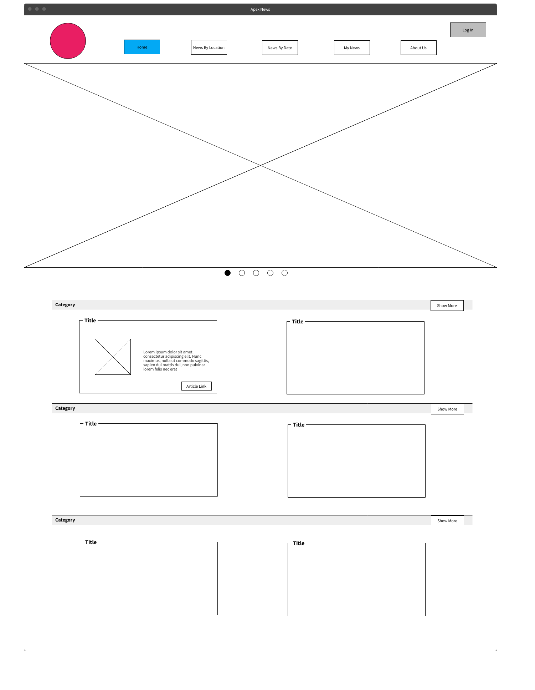
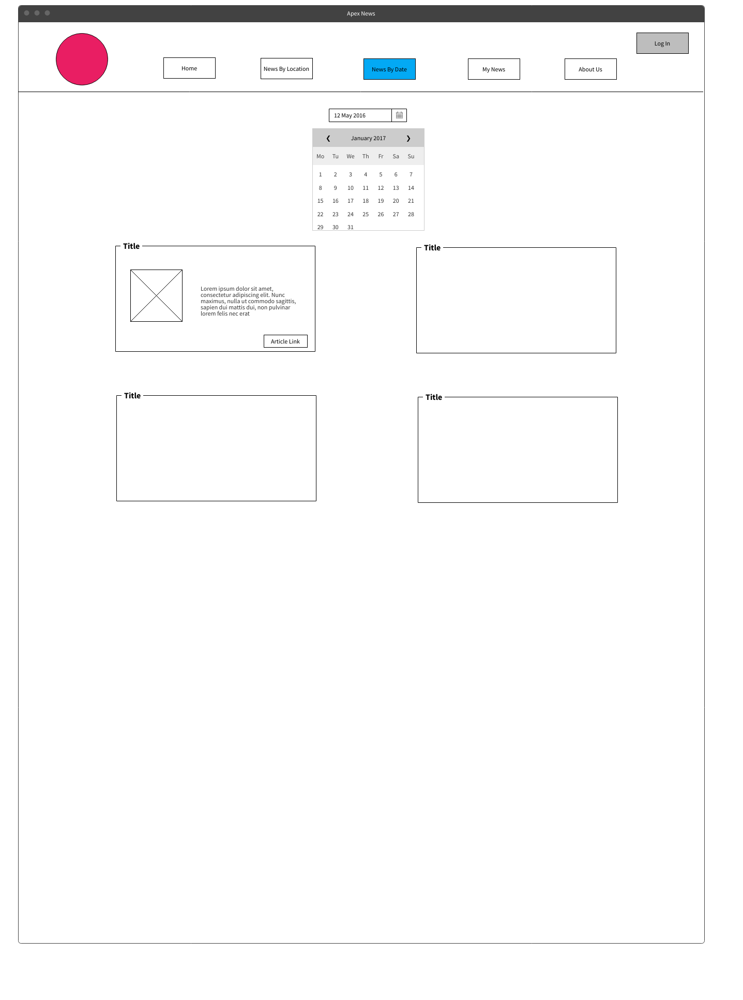
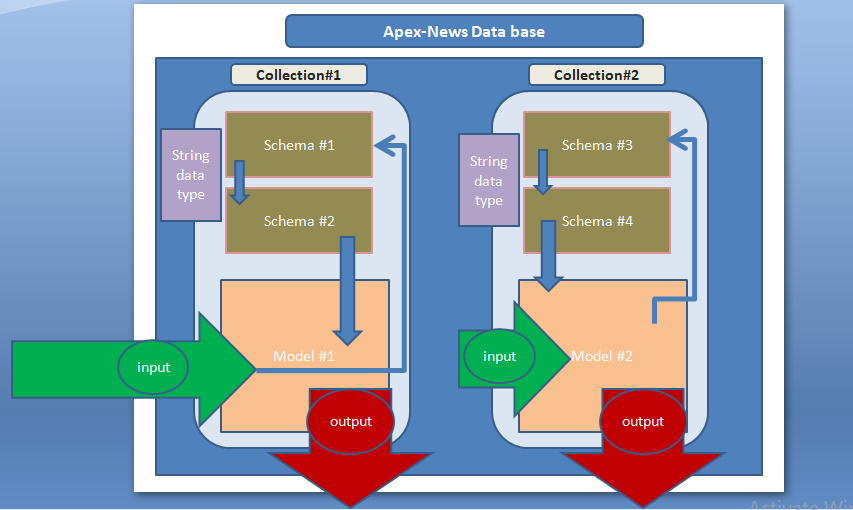

# Apex News

# Team members :

- Ahmad Abu Osbeh
- Yazan Tafesh
- Fatima Al-Shraa
- Bahaa Qasim
- Mohammad Saleh Zaytoon

# description

- create a fully functional CRUD app that shows the news based on the user inputs and gives the user abiltiy to update and delete some data in the website.

# wireframe
 

- Home page

- by country page 

- by time page

# User Stories

### User Story 1

As a client, who is interested in seeking news I want to be able to find the things i am interested in easily .
Feature tasks
- Logged in user can make a review.
- All users can see all news
- All users can choose category they want to read 
Acceptance Tests:
- Provide the correct data when user add a specific text for search and the correct category 
- Provide error message if no search parameters are entered and search button is pressed.
- users can add a review if they are logged in.

# User Story 2

As a user, I want to search for News by using specific word that I choose
Feature Tasks
-user can update the News in webise
- user can add comment in website
-can delete the comment if user didn't want it
Acceptance Tests
-Ensure that the data is the same for search
-Provide error message if system becomes unavailable
-delete any result have rumers

### User Story 3

As a non-admin user, I want the ability to search for any kind of news I want.
Feature Tasks:
- Logged in user can add a review, edit it and delete it.
- All users can see reviews but cant add unless logged in
- All users can read and search for news
Acceptance Tests:
- Provide error message if no data found about the search topic.
- Provide error message if no search parameters are entered and search button is pressed.
- Only show the 'Add Review' button to the user after logging in.

### User Story 4

As a user , I want to search for the news in different dates and different countries.
Feature Tasks:
- user can filtered the news.
- user can choose a news category.
- user can make a profile on the site and have extra options.
acceptance tests:
- provide easy way to move throw the site.
- provide good response to the orders the user makes.
- at the future the website could make a distinctive ads serve the user.

# Domain Modeling
 

  
 

# Database Schema Diagram

